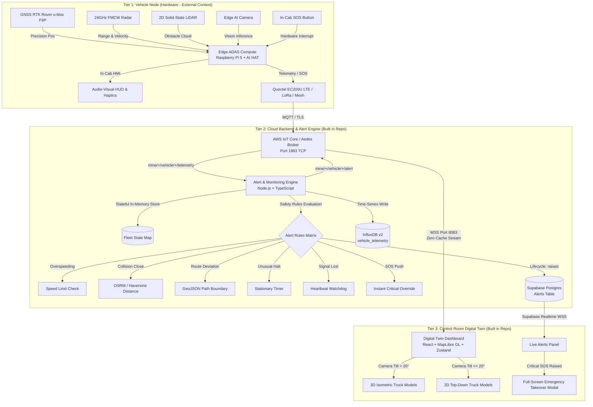
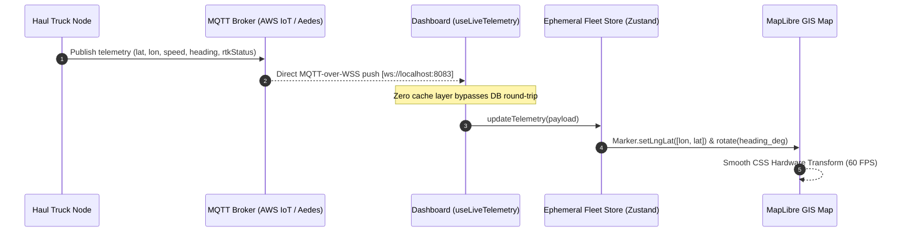
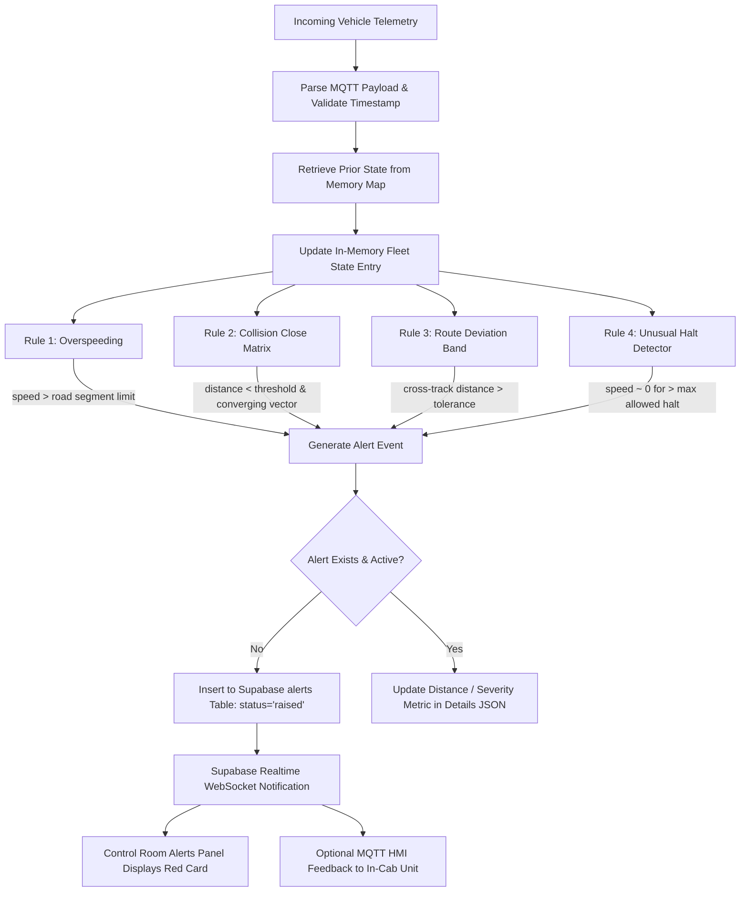
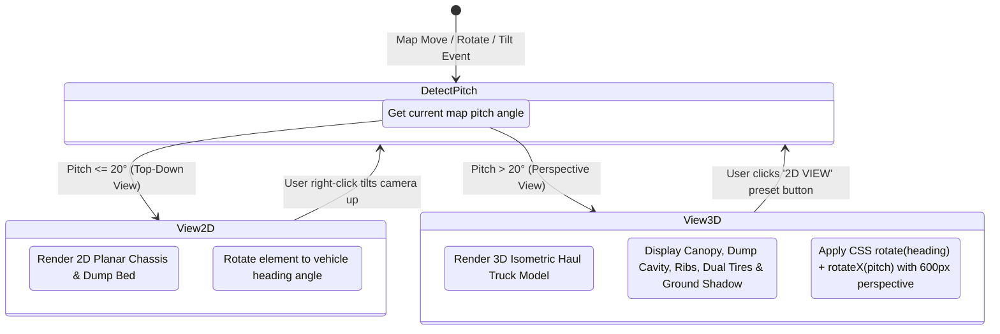
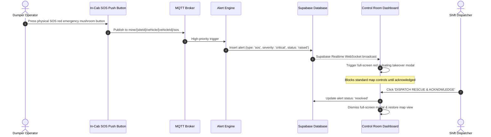

# Fog-Safe Haulage System (NMDC Bailadila — SIH 2026)

[](LICENSE)
[](https://vitejs.dev/)
[](https://reactjs.org/)
[](https://nodejs.org/)
[](https://www.typescriptlang.org/)
[](https://maplibre.org/)
[](https://mqtt.org/)
[](https://www.docker.com/)

An **ADAS Level 2-style safety, anti-collision, and live digital-twin fleet tracking platform** engineered for open-cast iron ore mine dumpers operating under zero-visibility advection fog ($<5\text{ m}$ visibility) during the monsoon season at **NMDC Limited's Bailadila Complex** (Kirandul & Bacheli, Chhattisgarh).

---

## 📑 Table of Contents

1. [Operational Challenge & Objectives](#-operational-challenge--objectives)
2. [End-to-End System Architecture](#-end-to-end-system-architecture)
3. [Architecture Data Flowcharts](#-architecture-data-flowcharts)
   - [Live Telemetry & Digital Twin Pipeline](#1-live-telemetry--digital-twin-zero-cache-pipeline)
   - [Alert & Monitoring Engine Decision Pipeline](#2-alert--monitoring-engine-decision-pipeline)
   - [Vehicle 2D ↔ 3D Dynamic View Transition](#3-vehicle-marker-2d--3d-dynamic-view-transition)
   - [Emergency SOS Full-Screen Takeover Protocol](#4-emergency-sos-full-screen-takeover-protocol)
4. [Repository Structure](#-repository-structure)
5. [Key Components](#-key-components)
   - [Digital Twin Control Room Dashboard (`dashboard/`)](#1-digital-twin-control-room-dashboard-dashboard)
   - [Stateful Alert & Monitoring Engine (`alert-engine/`)](#2-stateful-alert--monitoring-engine-alert-engine)
   - [Haul Fleet Simulator & Embedded Broker (`simulator/`)](#3-haul-fleet-simulator--embedded-broker-simulator)
6. [Data Contracts & Telemetry Schema](#-data-contracts--telemetry-schema)
7. [Getting Started (Quick Start)](#-getting-started-quick-start)
   - [Prerequisites](#prerequisites)
   - [Option A: Local Development (Instant Mock Mode)](#option-a-local-development-zero-external-credentials)
   - [Option B: Docker Compose](#option-b-docker-compose-full-stack)
8. [Environment Configurations](#-environment-configurations)
9. [Verification & Automated Testing](#-verification--automated-testing)
10. [Bailadila Mine Geographical Reference](#-bailadila-mine-geographical-reference)

---

## 🏔 Operational Challenge & Objectives

During the South-West monsoon season (June–October), the Bailadila hill range (elevations reaching $>1,200\text{ m}$ MSL) experiences severe advection cloud cover and heavy fog, reducing visibility on steep haulage ramps to **3–5 meters**. 

Heavy Earth Moving Machinery (HEMM) such as **240–360 tonne ultra-class dump trucks** (CAT 797F, Komatsu 930E) operate along winding bench ramps and crusher arterials:
- Traditional visual navigation and conventional single-frequency GPS fail due to signal multipath and dense cloud moisture.
- Fleets are forced to halt or crawl at $<5\text{ km/h}$, causing severe production loss and hazardous blind-spot collision risks.

**This platform solves this challenge with:**
1. **Zero-Latency Fleet Tracking:** Live vehicle positioning delivered straight to the control room screen over MQTT-WebSockets with zero intermediate database caching.
2. **Precision GIS Digital Twin:** GPU-accelerated MapLibre GL digital twin with authentic pit coordinates for Bailadila Deposit 14 (Kirandul) and Deposit 11 (Bacheli), complete with **2D plan ↔ 3D isometric vehicle transitions**.
3. **Stateful Fleet Collision & Hazard Engine:** Pure functional safety rules checking overspeeding, road deviations, converging collision trajectories (via Haversine & OSRM road distance), unusual halts, heartbeats, and emergency SOS signals.

---

## 🏗 End-to-End System Architecture



---

## 🔄 Architecture Data Flowcharts

### 1. Live Telemetry & Digital Twin (Zero-Cache Pipeline)

Live position data must **never** be served from a cached database record. The dashboard establishes a direct WebSockets connection to the MQTT message bus.



---

### 2. Alert & Monitoring Engine Decision Pipeline

The backend maintains an in-memory fleet state map to evaluate pairwise vehicle proximity and velocity convergence vectors.



---

### 3. Vehicle Marker 2D ↔ 3D Dynamic View Transition

To maximize browser responsiveness across standard operations consoles, the digital twin avoids heavy WebGL model pipelines and utilizes **hardware-accelerated 2D/3D SVG vector transforms**:



---

### 4. Emergency SOS Full-Screen Takeover Protocol



---

## 📁 Repository Structure

```
NexLinersZ/
├── alert-engine/                  # Node.js + TypeScript Stateful Alert Engine
│   ├── src/
│   │   ├── db/                    # Supabase (Postgres) & InfluxDB v2 clients
│   │   ├── mqtt/                  # AWS IoT Core & local MQTT connection manager
│   │   ├── rules/                 # Pure safety rule modules:
│   │   │   ├── collisionClose.ts  # Haversine + OSRM road distance proximity
│   │   │   ├── overspeeding.ts    # Segment & global speed limit enforcement
│   │   │   ├── routeDeviation.ts  # Cross-track GeoJSON deviation calculation
│   │   │   ├── signalLost.ts      # Heartbeat watchdog
│   │   │   ├── sos.ts             # Operator emergency handler
│   │   │   └── unusualHalt.ts     # Stationary vehicle monitor
│   │   ├── state/                 # In-memory fleet state store
│   │   ├── types/                 # Shared TypeScript data contracts
│   │   └── index.ts               # Service bootstrap & rule runner
│   ├── test/                      # Vitest test suite for safety rules
│   ├── Dockerfile                 # Multi-stage production container
│   └── package.json
│
├── dashboard/                     # React + Vite + MapLibre GL Control Room
│   ├── src/
│   │   ├── components/            # UI Panels, Drawer, Modals, and Maps:
│   │   │   ├── MapLibreView.tsx   # MapLibre GL digital twin (2D/3D trucks, roads)
│   │   │   ├── DigitalTwinMap.tsx # Tactical SVG HUD digital twin view
│   │   │   ├── Header.tsx         # Top NOC header with Sector Selector & clocks
│   │   │   ├── SectorNavigator.tsx# Left vehicle fleet roster sidebar
│   │   │   ├── TopToolbar.tsx     # 2D/3D, Normal/Dark map toggles, and filters
│   │   │   ├── AlertsPanel.tsx    # Live alerts feed with acknowledge/resolve
│   │   │   ├── VehicleDetailDrawer.tsx # Slide-over telemetry inspector
│   │   │   ├── OperationalSettingsModal.tsx # Dynamic speed limit governance
│   │   │   └── AiAnalyticsDrawer.tsx # Monsoon fog density & risk analytics
│   │   ├── hooks/                 # Real-time WebSocket subscriptions:
│   │   │   ├── useLiveTelemetry.ts# Direct MQTT-over-WSS (zero-cache)
│   │   │   └── useAlertsStream.ts # Supabase Realtime alerts subscription
│   │   ├── store/                 # Ephemeral state management:
│   │   │   └── fleetStore.ts      # Zustand store (strictly un-persisted)
│   │   ├── types/                 # TypeScript data contracts
│   │   ├── App.tsx                # Layout shell & SOS full-screen override
│   │   └── main.tsx               # DOM entrypoint
│   ├── Dockerfile                 # Nginx-based production distribution
│   └── package.json
│
├── simulator/                     # Standalone Telemetry Generator & Broker
│   ├── src/
│   │   ├── broker.ts              # Unified Aedes TCP (1883) + WSS (8083) Broker
│   │   ├── generator.ts           # Kinematic telemetry step generator
│   │   ├── routes.ts              # Authentic Bailadila Dep 14 haul waypoints
│   │   ├── vehicles.ts            # 5 test dumpers (normal, overspeed, halt, degraded)
│   │   └── index.ts               # Standalone telemetry publisher
│   ├── Dockerfile                 # Simulator container
│   └── package.json
│
├── docs/
│   └── PROJECT_PLAN.md            # Comprehensive engineering build specification
├── docker-compose.yml             # Orchestration for broker, engine, dashboard, influxdb
├── AGENTS.md                      # Agent rules, architecture guidelines, and constraints
└── README.md                      # Comprehensive documentation
```

---

## 🧩 Key Components

### 1. Digital Twin Control Room Dashboard (`dashboard/`)
- **Map Engine:** MapLibre GL JS utilizing CARTO Basemaps (`voyager` normal street/pit view and `dark_all` tactical night view).
- **Zero Cache Architecture:** Telemetry messages arriving over MQTT-WSS are fed directly into ephemeral Zustand memory, ensuring that vehicle coordinates on screen are the absolute ground truth.
- **Sector Switcher:** Instant camera fly-to and road alignment for:
  - `NMDC Bailadila - Dep 14 (Kirandul)`: `18.6320° N, 81.2585° E`
  - `NMDC Bailadila - Dep 11 (Bacheli)`: `18.6820° N, 81.2310° E`
  - `Pilbara Zone 4 - Sector North Pit`: `-22.3120° S, 119.5540° E`
- **Dynamic 2D ↔ 3D Vehicle Models:** Adapts seamlessly between a crisp 2D planar dumper cab and a full 3D isometric haul truck with payload cavity, dump body ribs, dual rear tires, and ground shadow.

### 2. Stateful Alert & Monitoring Engine (`alert-engine/`)
- **Runtime:** Node.js 20+ with TypeScript strict mode.
- **Pure Rule Modules:** Every rule is isolated as `(fleetState, newTelemetry) => AlertEvent[]`, allowing comprehensive testing via Vitest without needing an active network broker.
- **Dynamic Speed Limit Governance:** Subscribes to `mine/{siteId}/config/speedLimit` so dispatchers can raise or lower the speed cap during extreme fog pockets without service restarts.
- **Distance Calculation:** Employs Haversine formula and Open Source Routing Machine (OSRM) road routing to determine true driving distance along haulage corridors.

### 3. Haul Fleet Simulator & Embedded Broker (`simulator/`)
- **Built-in Aedes Broker:** Spawns a lightweight MQTT broker listening on port `1883` (TCP) and port `8083` (WebSocket stream).
- **Synthetic Vehicle Fleet:** Simulates 5 dump trucks traversing real Bailadila Deposit 14 terrain:
  - `DUMP-014` (Komatsu 930E): Standard cruising dumper on Ramp 1.
  - `DUMP-021` (CAT 797F): Trailing vehicle following `DUMP-014` for proximity checks.
  - `DUMP-007` (CAT 797F): Traversing Ramp 2 over ad-hoc mesh fallback.
  - `DUMP-019` (CAT 797F): Deliberate overspeeding scenario ($38.5\text{ km/h}$ against $20\text{ km/h}$ cap).
  - `DUMP-031` (Komatsu 830E): Degraded RTK float status operating over LoRaWAN.

---

## 📡 Data Contracts & Telemetry Schema

### MQTT Topics
| Topic | Direction | Frequency | Description |
|---|---|---|---|
| `mine/{siteId}/vehicle/{vehicleId}/telemetry` | Vehicle $\rightarrow$ Cloud | $1\text{ Hz}$ | High-frequency RTK position, velocity, heading |
| `mine/{siteId}/vehicle/{vehicleId}/sos` | Vehicle $\rightarrow$ Cloud | Event-driven | Manual operator in-cab emergency push button |
| `mine/{siteId}/vehicle/{vehicleId}/alert` | Engine $\rightarrow$ Vehicle | Event-driven | Alert dispatch to in-cab visual HUD / haptics |
| `mine/{siteId}/config/speedLimit` | Dashboard $\rightarrow$ Engine | On change | Live speed limit adjustments by dispatcher |

### Telemetry Payload Example
```json
{
  "vehicleId": "DUMP-014",
  "timestamp": "2026-09-06T12:00:00.000Z",
  "position": {
    "lat": 18.6320,
    "lon": 81.2585,
    "source": "rtk_fixed"
  },
  "speed_kmph": 22.4,
  "heading_deg": 45,
  "rtkStatus": "fixed",
  "connectivity": "lte"
}
```

### Supabase `alerts` Table Schema
```sql
CREATE TABLE IF NOT EXISTS public.alerts (
    alert_id UUID PRIMARY KEY DEFAULT gen_random_uuid(),
    vehicle_id VARCHAR(64) NOT NULL,
    type VARCHAR(64) NOT NULL,       -- 'overspeeding' | 'collision_close' | 'sos' | etc.
    severity VARCHAR(32) NOT NULL,   -- 'low' | 'medium' | 'high' | 'critical'
    status VARCHAR(32) NOT NULL DEFAULT 'raised', -- 'raised' | 'acknowledged' | 'resolved'
    raised_at TIMESTAMPTZ NOT NULL DEFAULT NOW(),
    acknowledged_at TIMESTAMPTZ,
    resolved_at TIMESTAMPTZ,
    details JSONB DEFAULT '{}'::jsonb
);

CREATE INDEX idx_alerts_vehicle_status ON public.alerts (vehicle_id, status);
ALTER PUBLICATION supabase_realtime ADD TABLE public.alerts;
```

---

## 🚀 Getting Started (Quick Start)

### Prerequisites
- [Node.js](https://nodejs.org/) v20+ and `npm`
- [Docker](https://www.docker.com/) & Docker Compose (optional for containerized run)

---

### Option A: Local Development (Zero External Credentials)

The system is engineered to run out of the box with zero external cloud accounts. The simulator hosts an embedded broker, and the alert engine defaults to in-memory tables if Supabase keys are omitted.

#### 1. Start the Simulator & MQTT Broker
```powershell
cd simulator
npm install
npm run dev
```
*Output: Spawns TCP broker on port `1883`, WebSocket broker on port `8083`, and starts publishing telemetry for 5 dumpers.*

#### 2. Start the Alert & Monitoring Engine
In a second terminal:
```powershell
cd alert-engine
npm install
npm run dev
```
*Output: Connects to `mqtt://localhost:1883`, evaluates rules against live telemetry, and flags alerts in memory.*

#### 3. Start the Digital Twin Control Room
In a third terminal:
```powershell
cd dashboard
npm install
npm run dev
```
Open **[http://localhost:5173](http://localhost:5173)** in your browser to view the live digital twin.

---

### Option B: Docker Compose (Full Stack)

To build and run all services in unified production containers:

```powershell
# In the root repository directory:
docker compose up --build
```

Services exposed:
- **Control Room Dashboard:** `http://localhost:5173`
- **MQTT WebSocket Broker:** `ws://localhost:8083`
- **MQTT TCP Broker:** `tcp://localhost:1883`
- **InfluxDB Time-Series UI:** `http://localhost:8086`

---

## ⚙️ Environment Configurations

Each package contains an `.env.example` template:

### `dashboard/.env`
```env
# CARTO Basemaps API Key (optional - leave empty for standard tiles)
VITE_CARTO_API_KEY=

# Live position channel: direct MQTT over WebSocket to embedded simulator broker
VITE_MQTT_WS_URL=ws://localhost:8083

# Supabase (optional for local dev, required for cloud realtime alerts)
VITE_SUPABASE_URL=
VITE_SUPABASE_ANON_KEY=
```

### `alert-engine/.env`
```env
# MQTT Broker Config (defaults to local broker)
MQTT_BROKER_URL=mqtt://localhost:1883
MINE_SITE_ID=bailadila

# AWS IoT Core Config (when deploying to AWS cloud)
AWS_IOT_ENDPOINT=
AWS_IOT_CERT_PATH=
AWS_IOT_KEY_PATH=
AWS_IOT_CA_PATH=

# Supabase Configuration
SUPABASE_URL=
SUPABASE_ANON_KEY=
SUPABASE_SERVICE_ROLE_KEY=

# InfluxDB Telemetry Storage
INFLUXDB_URL=http://localhost:8086
INFLUXDB_TOKEN=
INFLUXDB_ORG=nmdc-bailadila
INFLUXDB_BUCKET=telemetry
```

---

## 🧪 Verification & Automated Testing

The Alert & Monitoring Engine includes a comprehensive test suite powered by [Vitest](https://vitest.dev/):

```powershell
cd alert-engine
npm test
```

### Automated Safety Test Coverage
- `overspeeding.test.ts`: Verifies speed thresholds, delta severity scaling, and dynamic speed cap updates.
- `collisionClose.test.ts`: Validates paired position tracking, closing trajectory vectors, and OSRM/Haversine distance triggers.
- `sos.test.ts`: Verifies emergency operator alerts always generate `critical` severity.
- `unusualHalt.test.ts`: Tests non-designated stop timeouts.
- `routeDeviation.test.ts`: Validates cross-track boundary tolerances against designated haul routes.
- `signalLost.test.ts`: Ensures dead-zone heartbeats trigger timely warnings when both LTE and mesh radio go silent.

---

## 📍 Bailadila Mine Geographical Reference

| Complex | Key Deposit | Center Coordinates (WGS84) | Elevation | Primary Haul Assets |
|---|---|---|---|---|
| **Kirandul Complex** | **Deposit 14 (Main Pit)** | `18.6320° N, 81.2585° E` | $1,210\text{ m}$ | CAT 797F, Komatsu 930E (240–360t) |
| **Bacheli Complex** | **Deposit 11A (North Ridge)**| `18.6820° N, 81.2310° E` | $1,180\text{ m}$ | CAT 785D, Komatsu 830E (150–240t) |
| **Test Sector** | **Pilbara Zone 4** | `-22.3120° S, 119.5540° E` | $450\text{ m}$ | Global benchmarking sector |

---

## 👥 Contributors & Acknowledgments

- **Team NexLinersZ** — Developed for the Smart India Hackathon (SIH 2026).
- **Industry Partner & Context:** NMDC Limited, Bailadila Iron Ore Mines (Kirandul & Bacheli Complex, Chhattisgarh).
- Built with MapLibre GL, React, Vite, Node.js, Aedes MQTT, Supabase, and Tailwind CSS.
